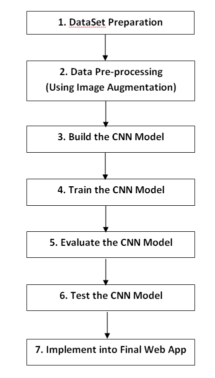

# Dog Emotion Identification System
This is a model that identifies the dog emotion i.e. whether dog is happy, angry, neutral or sad.

#### Algorithm:

#### Dataset:
There are 2560 images for training the model belonging to 4 classes:
1. 560 Angry images,
2. 680 Happy images,
3. 616 Neutral images,
4. 704 Sad images,

There are1096 images for validating the model belonging to 4 classes:
1. 248 Angry images
2. 296 Happy images
3. 264 Neutral images
4. 288 Sad images.

#### Platform Used:

>> Language: Python, HTML, CSS, JavaScript
>> Tool: Jupyter Notebook, VS Studio
>> BuildIn: Django Framework

#### To run the App:
1. Open cmd
2. Change the Directory to ".../dog emotion identificcation system/src" (using cmd command cd)
3. In cmd type "pipenv shell"and run
4. In cmd type "python manage.py runserver" and run
5. Copy the url you see in cmd to run the Django framework on browser.
6. You are ready to use the application

